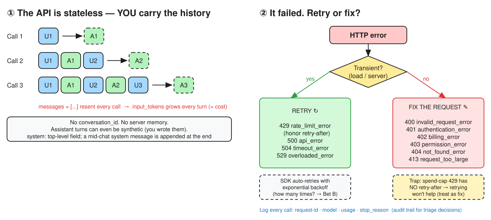

# W1 · D1 — First contact: the Messages API and how it fails

> **Hook:** Claude doesn't remember your last message, and some errors should be retried while others never will succeed. **What does a request really carry, and which failures do you retry?**

| | |
|---|---|
| **Phase** | CCDV-F Week 1 — The API layer (Domain 2: Applications and Integration) |
| **Date** | 2026-10-02 |
| **Time box** | 85–100 min · est. spend $0.05–$0.30 · no GPU |
| **Deliverable** | This file: request anatomy, stop reasons, and the error table with *retry or fix?* per code |


*Editable source: [`d01-api.excalidraw`](./d01-api.excalidraw)*

---

## 🎲 Bets (placed before reading)

| Bet | Question | My bet | Correct answer | Result |
|---|---|---|---|---|
| **A** | Turn 2 sends *only* "what's my case id?". What happens? | Claude doesn't know: you must resend the whole history every call | *Fill in after the m2-turns read* | ✅ Win (confirmed by the first sentence of *Multiple conversational turns*) |
| **B** | How many times do the SDKs retry a 529 by default? | **1 retry** | **2 retries**, exponential backoff, honoring `retry-after` | ❌ Lost: logged in gap-log |

---

## Progress

- [ ] **M0** Place bets ✅ *(done here)*
- [x] **M1** Workspace `ccdv-lab` + $25 cap + API key · repo scaffold · `notes/objectives.md` + `notes/gap-log.md`
- [x] **M2** Anatomy of a request *(basic ✅, turns ✅, prefill ✅)*
- [x] **M3** How the API fails *(HTTP errors, request ID, rate limits)*
- [ ] ☕ 5-min break
- [ ] **M4** Synthetic data + three-turn `hello.py`
- [ ] **M5** Break it on purpose (404, 400 ×2, optional `max_retries=0`)
- [ ] **M6** Write up, commit, tick Day 1

---

## 1. Request anatomy

**Required fields:** `model`, `max_tokens`, `messages`
**Source:** [Using the Messages API → Basic request and response](https://platform.claude.com/docs/en/build-with-claude/working-with-messages#basic-request-and-response)

```python
client.messages.create(
    model="claude-sonnet-5-5",      # required
    max_tokens=256,                 # required
    system="You are a terse AML operations assistant.",  # optional, top-level
    messages=[                      # required: the FULL history, every call
        {"role": "user", "content": "My case id is C-104. Say OK."},
        {"role": "assistant", "content": "OK."},
        {"role": "user", "content": "What's my case id?"},
    ],
)
```

- **Stateless.** *"The Messages API is stateless, which means that you always send the full conversational history to the API."* ([source](https://platform.claude.com/docs/en/build-with-claude/working-with-messages#multiple-conversational-turns))
  - Cost consequence: every turn re-bills the whole history as input tokens, so `input_tokens` grows each turn.
- **Synthetic assistant turns:** earlier `assistant` turns don't have to come from Claude; you can write them yourself.
- **`system`:** use the top-level field for instructions that apply from the start. A mid-conversation system message is appended at the end, so it doesn't invalidate the cached prefix.
- **Sampling params:** `temperature`, `top_p` and `top_k` are **not supported on Claude 4.7 and later** (or Mythos Preview). Setting a **non-default value returns a 400**; it isn't silently ignored.
- **Prefill:** **not supported on Claude 4.6 and later** (or Mythos Preview); it returns a **400**. Use [structured outputs](https://platform.claude.com/docs/en/build-with-claude/structured-outputs) or system-prompt instructions instead. ([source](https://platform.claude.com/docs/en/build-with-claude/working-with-messages#prefilling-claudes-response))

> ⚠️ **Exam trap: old tricks on new models.** *"Prefill `{` to force JSON"* and *"temperature 0 for determinism"* both fail on current models. The current answers are **structured outputs** and **clear instructions**.

---

## 2. Stop reasons

| `stop_reason` | Meaning | What the client does | Seen it? |
|---|---|---|---|
| `end_turn` | Claude finished naturally | Use the response | ⬜ |
| `max_tokens` | Hit your `max_tokens` cap mid-output | Raise the cap or continue; output may be truncated | ⬜ |
| `tool_use` | Claude wants you to run a tool | Run it, send back a `tool_result`, call again | ⬜ |
| `refusal` | Declined for policy reasons; `stop_details` names the policy category | Log it; don't blindly retry | ⬜ |

---

## 3. Error table: retry or fix?

<details>
<summary><b>Open after Mission 3's read</b> (keeps Bet B honest)</summary>

**Source:** [Errors → HTTP errors](https://platform.claude.com/docs/en/api/errors#http-errors)

| Code | Type | Retry or fix? | What I'd log |
|---|---|---|---|
| 400 | `invalid_request_error` | **Fix**: malformed request, missing `max_tokens`, prefill on 4.6+ | request_id, model, error message |
| 401 | `authentication_error` | **Fix**: bad or missing key | request_id; alert ops (never log the key) |
| 402 | `billing_error` | **Fix**: billing issue | request_id; alert the account owner |
| 403 | `permission_error` | **Fix**: key lacks access | request_id, workspace |
| 404 | `not_found_error` | **Fix**: wrong model or resource (e.g. `claude-sonnet-9`) | request_id, model string |
| 413 | `request_too_large` | **Fix**: shrink the payload | request_id, payload size |
| 429 | `rate_limit_error` | **Retry** after `retry-after`. ⚠️ A **spend-cap 429 has no `retry-after`** and keeps failing until access resumes: treat it as a fix | request_id, `anthropic-ratelimit-*` headers |
| 500 | `api_error` | **Retry** with backoff | request_id |
| 504 | `timeout_error` | **Retry**; for requests over 10 min use **streaming** or **Message Batches** | request_id, duration |
| 529 | `overloaded_error` | **Retry** with backoff | request_id |

> **SDK retries:** *"The official SDKs automatically retry transient failures (such as connection errors, rate limits, and 5xx server errors) with exponential backoff, **twice by default**, honoring the `retry-after` header when present."*
> → Bet B result: ❌ bet 1, actual **2**

**Request ID** ([source](https://platform.claude.com/docs/en/api/errors#request-id)): every response has a `request-id` header. The Python SDK exposes it as `msg._request_id`, and error bodies repeat it as `request_id`.

**Long requests:** over **10 minutes**, use streaming or the Message Batches API, because idle connections can be dropped.

**Rate limits** ([source](https://platform.claude.com/docs/en/api/rate-limits#rate-limits)):
- Three dimensions per model: **RPM**, **ITPM**, **OTPM**
- Token bucket: capacity refills continuously up to the limit, not at fixed intervals
- A 429 carries `retry-after` in seconds; the `anthropic-ratelimit-*` response headers show limits and what remains

</details>

---

## 4. Lab results (Mission 4)

> ⚠️ The plan says `claude-sonnet-5`, but that ID isn't on the [current models list](https://platform.claude.com/docs/en/about-claude/models/overview). `hello.py` defaults to `claude-sonnet-5-5` (override with `CCDV_MODEL`).

**Three-turn run** (`uv run scripts/hello.py`):

| Turn | stop_reason | input_tokens | output_tokens | request_id |
|---|---|---|---|---|
| 1 | | | | |
| 2 | | | | |
| 3 | | | | |

**Stripped run** (`uv run scripts/hello.py --stripped`): did it recall C-104? ______

## 4b. 🔧 Real incident: the 401 that wasn't from Anthropic *(objectives 4.1 · 7.4)*

| Step | Observation | What it ruled out or showed |
|---|---|---|
| 1 | `401 authentication_error` · `invalid x-api-key` · `request_id: req_011CfeB2thxZdRTa1TRzEsjh` | Anthropic answered (it has a request id), so a key was sent and rejected. **Fix, don't retry.** |
| 2 | Created a new key, still 401, but now `API key is invalid.` with **`request_id: None`** | No request id means the response probably didn't come from the API itself |
| 3 | `scripts/check_key.py`: `base_url = https://api.anthropic.com`, no proxy vars, key prefix **`sk-ant-usr`**, raw call → `401`, `server=cloudflare`, no request id | Not a redirect or proxy. The key itself is being turned away before it reaches the API |
| 4 | [Get your API key](https://platform.claude.com/docs/en/get-api-key): keys are *personal*, *service account* or legacy *workspace* keys. A key that works on multiple workspaces **must send `anthropic-workspace-id`** | Likely cause: the personal key wasn't scoped to a workspace |
| ✅ | **Re-created the key scoped to `ccdv-lab`**: works | Root cause: an unscoped personal key with no `anthropic-workspace-id` header |

**Lessons**
- **No `request-id` on an error is a clue:** the failure happened before the API, at the edge, a proxy or a gateway. Isolate the layer before touching the code.
- **Scope keys to a workspace.** It removes the need for the header *and* keeps spend under that workspace's limit ($25 on `ccdv-lab`).
- **Diagnose without leaking secrets:** print the prefix and length only, never the key.

## 5. Break it on purpose (Mission 5)

| Experiment | Status | Error type | Message | request_id |
|---|---|---|---|---|
| 🎁 *(bonus, unplanned)* first `hello.py` run with a bad key | 401 | `authentication_error` | `invalid x-api-key` | `req_011CfeB2thxZdRTa1TRzEsjh` |
| model `claude-sonnet-9` | | | | |
| no `max_tokens` | | | | |
| prefilled final `assistant` turn on `claude-sonnet-5-5` | | | | |
| *(optional)* `max_retries=0` during a 529 storm → what changes? | | | | |

---

## 💡 Lessons learnt

1. The API has no memory. "Conversation" is an array **you** own, and its token cost grows every turn.
2. Classify errors by **whose problem it is**: transient server or load errors (429/500/504/529) get retried; request, auth or billing errors (400/401/402/403/404/413) get fixed.
3. A 429 is not always transient. With no `retry-after` it's a **spend cap**, and retrying just burns time.
4. Old prompt hacks (prefill, temperature 0) are now **400s or unsupported**. Reach for structured outputs.
5. Log the `request_id` on every call. It is the thread that ties an audit trail back to Anthropic's side.

## Done when

- [ ] This file has the request anatomy, stop reasons and the error table
- [ ] I can say which errors I **retry** (429, 500, 529) and which I **fix** (400, 401, 403, 404, 413)
- [ ] I can explain why the API is stateless and what that means for cost as a chat grows
- [ ] `data/alerts.json`, `customers.json` and `transactions.json` exist and are synthetic

## 🧭 Side quest (10 min): Claude through Amazon Bedrock

[Claude in Amazon Bedrock → Feature support](https://platform.claude.com/docs/en/build-with-claude/claude-in-amazon-bedrock#feature-support)
- Model IDs carry the `anthropic.` prefix, e.g. `anthropic.claude-opus-5-5`
- **Not on Bedrock:** structured outputs, URL/Files API input sources, server-side tools, the Message Batches API, Managed Agents

## 🪞 Reflection (2 min)

- **Which of today's errors would page someone at 3 a.m., and which should the client simply retry?**
  -
- **Financial-crime angle: what would you log per call (request id, model, tokens) so an auditor can reconstruct a triage decision?**
  -

## 🅿️ Parking lot

-
